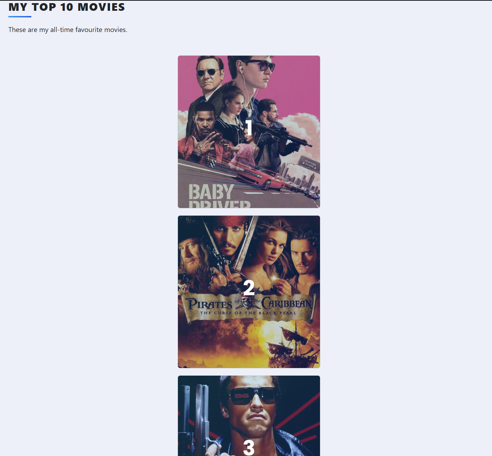

# 🎬 My Top 10 Movies App

A Flask web app for managing your personal list of top-rated movies — with live data from the TMDb API.

## Features

- **Search and add** movies by title (via The Movie Database API)
- **Movie details** (poster, release year, description)
- **Rate and review** your favorite movies
-  **Delete** movies from your list
- **Sorts automatically** by rating (from highest to lowest)

## Tech Stack

- Python 3
- Flask + Flask-Bootstrap
- SQLAlchemy + SQLite
- Flask-WTF + WTForms
- TMDb API (https://www.themoviedb.org/)

## Screenshots




## How to Run

1. **Clone the repository**:
   ```bash
   git clone https://github.com/Hugebob1/MyTop10Movies.git
   cd MyTop10Movies
